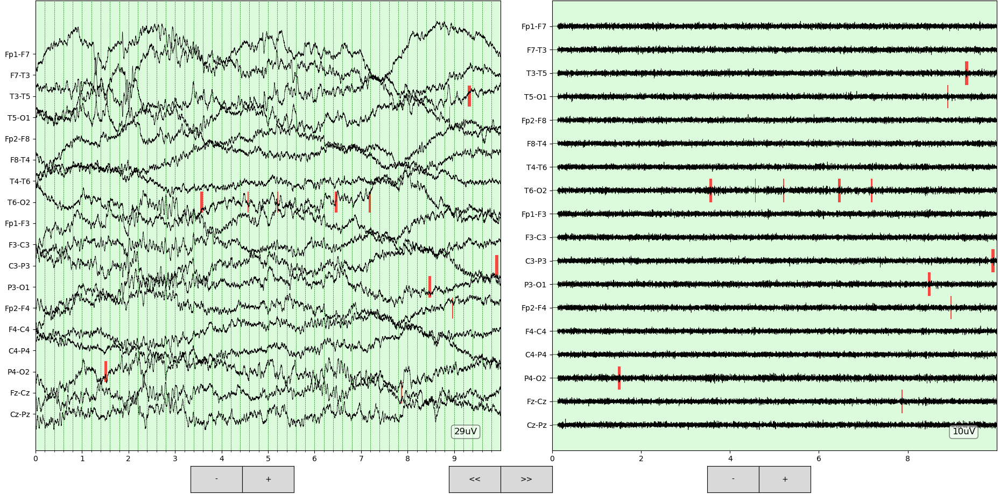

# Global_Scalp_HFO_Detector
These scripts perfrom the following steps:

- Read scalp EEG and convert to double banana bipolar montage
- Extract HFO and Artefact events
- Discard HFO events within artefact markings
- Open an EEG reviewer showing the Artefact and HFO events

### EEG Reviewer:

